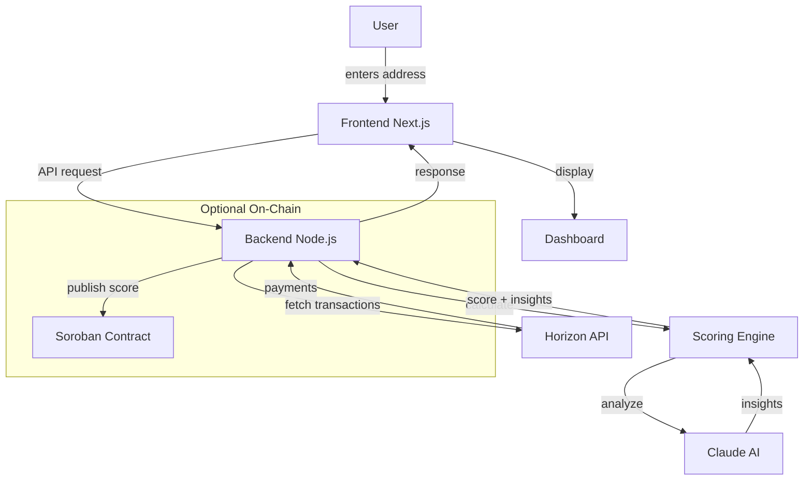
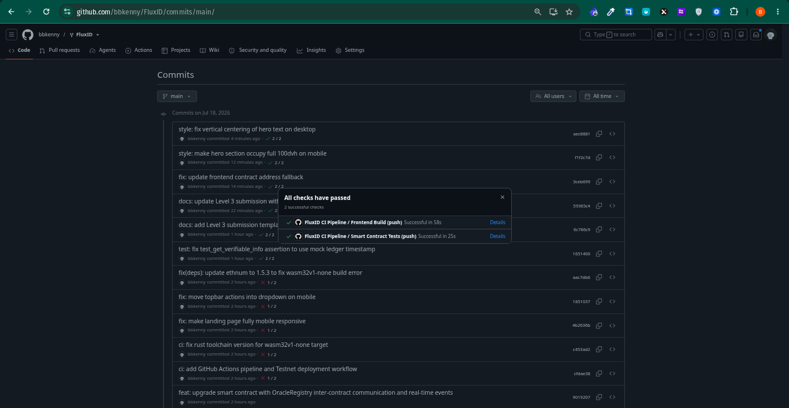
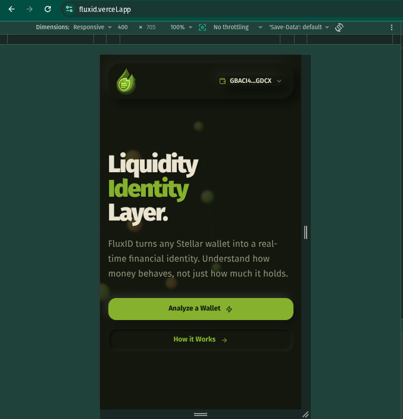

# FluxID

**Liquidity Identity Layer on Stellar — Turn any wallet into a real-time financial identity.**

[](https://stellar.org)
[](https://anthropic.com/)

---

## 🟡 Level 2 — Yellow Belt Mandatory Proof

Everything a reviewer needs to verify Level 2 is collected here so nothing has to be hunted for across the repo.

| Requirement | Status | Proof |
|---|---|---|
| Contract deployed on testnet | ✅ | Contract ID `CAUICITFNLDMHPXARAXARFBS3JKRGZZP5CE7B4DTLFBCJB5F4U24CKBP` — [view on stellar.expert](https://stellar.expert/explorer/testnet/contract/CAUICITFNLDMHPXARAXARFBS3JKRGZZP5CE7B4DTLFBCJB5F4U24CKBP) |
| Transaction hash of a contract call | ✅ | [`a00cfdea…de3e`](https://stellar.expert/explorer/testnet/tx/a00cfdeaadf703ca17b033013974e130e3baab961450fc4a18064230f0d2de3e) and [`b58a679b…91c7`](https://stellar.expert/explorer/testnet/tx/b58a679bf231a0f74c41fe4d67e115736773170766106adee4a11eab820591c7) |
| Contract called from the frontend | ✅ | [`frontend/app/dashboard/contract/page.tsx`](https://github.com/bbkenny/FluxID/blob/main/frontend/app/dashboard/contract/page.tsx) reads/writes the Soroban contract via RPC |
| Multi-wallet connect (Freighter / Albedo / xBull) | ✅ | [`frontend/app/context/FreighterContext.tsx`](https://github.com/bbkenny/FluxID/blob/main/frontend/app/context/FreighterContext.tsx) — see snippet below |
| 3+ error types handled | ✅ | User rejection, wallet not installed, and signing/insufficient-balance failures — see wallet snippet below |
| Transaction status visible | ✅ | Pending → success/fail states in [`frontend/app/dashboard/transfer/page.tsx`](https://github.com/bbkenny/FluxID/blob/main/frontend/app/dashboard/transfer/page.tsx) |
| Minimum 2+ meaningful commits | ✅ | See the repo [commit history](https://github.com/bbkenny/FluxID/commits/main) (190+ commits) |

### 📂 Repository Structure (where each mandatory file lives)

The Soroban contract lives under a `contracts/` folder, nested inside `smartcontract/`:

```
FluxID/
├── smartcontract/
│   └── contracts/
│       ├── liquidity_identity/
│       │   └── src/
│       │       ├── lib.rs      ← main contract source
│       │       └── test.rs     ← contract tests
│       └── oracle_registry/
│           └── src/
│               └── lib.rs      ← authorization registry contract
├── frontend/                   ← Next.js app (multi-wallet, dashboard)
│   └── app/
│       ├── context/FreighterContext.tsx   ← wallet connection
│       └── dashboard/                      ← contract calls, transfers, status
└── backend/                    ← Node.js API (scoring, Horizon, payments)
```

- **Contract source:** [`smartcontract/contracts/liquidity_identity/src/lib.rs`](https://github.com/bbkenny/FluxID/blob/main/smartcontract/contracts/liquidity_identity/src/lib.rs)
- **Contract tests:** [`smartcontract/contracts/liquidity_identity/src/test.rs`](https://github.com/bbkenny/FluxID/blob/main/smartcontract/contracts/liquidity_identity/src/test.rs)

### 🦀 Smart Contract — core function (from `lib.rs`)

Full file: [`smartcontract/contracts/liquidity_identity/src/lib.rs`](https://github.com/bbkenny/FluxID/blob/main/smartcontract/contracts/liquidity_identity/src/lib.rs)

```rust
pub fn set_score(
    env: Env,
    caller: Address,
    wallet: Address,
    score: u32,
    risk: RiskLevel,
    score_input_hash: BytesN<32>,
) {
    caller.require_auth();

    // Cross-contract call to OracleRegistry to check authorization
    let registry_id: Address = env
        .storage()
        .instance()
        .get(&DataKey::OracleRegistryId)
        .unwrap_or_else(|| panic!("OracleRegistry not configured"));

    let is_authorized: bool = env.invoke_contract(
        &registry_id,
        &soroban_sdk::Symbol::new(&env, "is_oracle_authorized"),
        soroban_sdk::vec![&env, caller.to_val()],
    );

    if !is_authorized {
        panic!("Unauthorized: caller is not an authorized oracle");
    }

    if score > 100 {
        panic!("Score must be between 0 and 100");
    }

    // ... persists score, risk, timestamp and the verifiable input hash ...

    // Emit a ScoreSet event so off-chain indexers and users can observe
    // every score update without trusting the admin.
    env.events().publish(
        (Symbol::new(&env, "score_set"), wallet.clone()),
        (score, risk, timestamp, score_input_hash.clone()),
    );
}
```

### 🔌 Frontend — multi-wallet connect + error handling (from `FreighterContext.tsx`)

Full file: [`frontend/app/context/FreighterContext.tsx`](https://github.com/bbkenny/FluxID/blob/main/frontend/app/context/FreighterContext.tsx)

```tsx
// Multi-wallet init via StellarWalletsKit (Freighter, Albedo, xBull)
StellarWalletsKit.init({
  network: Networks.TESTNET,
  selectedWalletId: "freighter",
  modules: [new FreighterModule(), new AlbedoModule(), new xBullModule()],
});

// Restore an existing session with getAddress()
const { address } = await StellarWalletsKit.getAddress();

// Connect flow with three distinct error types handled
const connect = useCallback(async () => {
  try {
    const { address } = await StellarWalletsKit.authModal();
    setState({ isConnected: true, publicKey: address, /* ... */ });
  } catch (err: any) {
    let errMsg = err.message || "Failed to connect to wallet.";
    if (errMsg.toLowerCase().includes("reject")) {
      errMsg = "Wallet connection rejected by user.";        // 1) user rejection
    } else if (errMsg.toLowerCase().includes("not found")) {
      errMsg = "Wallet is not installed or not found.";      // 2) wallet missing
    }
    setState((prev) => ({ ...prev, error: errMsg }));         // 3) generic/other failure
    showToast(errMsg, "error");
  }
}, [showToast]);
```

Transactions are signed via `kit.signTransaction(...)` in
[`transfer/page.tsx`](https://github.com/bbkenny/FluxID/blob/main/frontend/app/dashboard/transfer/page.tsx)
and [`contract/page.tsx`](https://github.com/bbkenny/FluxID/blob/main/frontend/app/dashboard/contract/page.tsx),
with pending/success/fail status shown in the UI.

---

## Overview

FluxID is a liquidity intelligence layer built on **Stellar** that turns any wallet into a real-time financial identity.

Instead of just showing balances, FluxID analyzes **how money behaves**, inflow patterns, outflow stability, transaction frequency, and flow consistency and produces a simple, explainable trust score.

> **The Problem:** Traditional finance and crypto both track what you have, but not how you behave financially. Trust becomes guesswork.
> 
> **FluxID's Solution:** A dynamic Liquidity Identity, that analyze any Stellar wallet address without permission, get a 0-100 trust score with risk level, and understand why through AI-generated insights.

---

## Architecture



### Data Flow

1. **User** enters Stellar wallet address in frontend
2. **Frontend** sends request to backend API
3. **Backend** fetches transactions via Stellar Horizon
4. **Scoring Engine** calculates liquidity score (0-100) and risk level
5. **Claude AI** analyzes patterns and generates behavior insights
6. **Frontend** displays score, risk, and AI insights
7. **Optional**: Score stored on Soroban for on-chain verification

---

## Stellar Integration

FluxID is built natively on **Stellar** for all blockchain operations.

### Horizon API — Transaction Fetching

| Function | What It Does |
|----------|-------------|
| [`getPayments()`](https://github.com/StellarVhibes/FluxID/blob/main/backend/src/services/horizon.service.ts#L36) | Fetches wallet payments via Horizon API |
| [`getAccountTransactions()`](https://github.com/StellarVhibes/FluxID/blob/main/backend/src/services/horizon.service.ts#L85) | Full transaction history |
| [Swap filtering](https://github.com/StellarVhibes/FluxID/blob/main/backend/src/services/horizon.service.ts#L62) | Excludes self-swaps from inflow/outflow |

### Freighter Wallet — Connection

| Function | What It Does |
|----------|-------------|
| [`useFreighter()`](https://github.com/StellarVhibes/FluxID/blob/main/frontend/app/context/FreighterContext.tsx#L189) | Wallet connection hook |
| [`connect()`](https://github.com/StellarVhibes/FluxID/blob/main/frontend/app/context/FreighterContext.tsx#L27) | Connect to Freighter |
| [Sign payment](https://github.com/StellarVhibes/FluxID/blob/main/frontend/lib/agentDemo.ts#L10) | Agent payment signing |

### Soroban — On-Chain Storage (Optional)

| Contract | What It Does |
|----------|-------------|
| [Score storage](https://github.com/StellarVhibes/FluxID/blob/main/backend/src/routes/contract.routes.ts#L35) | Store scores on-chain |
| [Get score](https://github.com/StellarVhibes/FluxID/blob/main/backend/src/routes/contract.routes.ts#L71) | Read from contract |

---

## AI Integration

FluxID uses **Anthropic Claude** for explainable behavior insights.

### Claude AI — Behavior Analysis

| Function | What It Does |
|----------|-------------|
| [`explainBehavior()`](https://github.com/StellarVhibes/FluxID/blob/main/backend/src/services/explainability/llm.ts#L10) | Claude Haiku integration |
| [`getExplanation()`](https://github.com/StellarVhibes/FluxID/blob/main/backend/src/services/explainability/index.ts#L8) | Entry point for AI |
| [Score + AI](https://github.com/StellarVhibes/FluxID/blob/main/backend/src/routes/score.routes.ts#L66) | Combined score + AI response |

**What Claude Analyzes:**
- Inflow/outflow consistency
- Transaction patterns over time
- Volume trends
- Risk factors
- Asset diversity

**Response:**
```json
{
  "insight": "This wallet shows consistent incoming payments...",
  "suggestions": ["Increase transaction frequency", "Diversify counterparties"]
}
```

---

## Agentic AI — X402 Payments

FluxID enables AI agents to **pay for intelligence** using Stellar.

### Payment Flow

| Step | What Happens |
|------|------------|
| 1. Request | Agent requests `/paid/score/{wallet}` |
| 2. 402 Response | [`HTTP 402 Payment Required`](https://github.com/StellarVhibes/FluxID/blob/main/backend/src/routes/paid.routes.ts#L184) |
| 3. Payment | Agent pays XLM via Freighter |
| 4. Verify | [On-chain verification](https://github.com/StellarVhibes/FluxID/blob/main/backend/src/services/payment.service.ts#L92) |
| 5. Score | Return score after payment |

### Agent Demo

Live demo showing AI agent:
- [Requesting score](https://github.com/StellarVhibes/FluxID/blob/main/frontend/lib/agentDemo.ts#L69)
- [Signing payment](https://github.com/StellarVhibes/FluxID/blob/main/frontend/lib/agentDemo.ts#L58)
- [Polling for result](https://github.com/StellarVhibes/FluxID/blob/main/frontend/lib/agentDemo.ts#L145)

---

## Core Features

| Feature | Description |
|---------|------------|
| Address-based analysis | Analyze any wallet without permission |
| Liquidity Score | 0-100 trust score |
| Risk Level | Low / Medium / High |
| Flow breakdown | Inflows, outflows, swaps tracked separately |
| Behavior insights | AI-generated explanation |
| Suggestions | Actionable recommendations |

---

## Use Cases

FluxID is infrastructure for:

- **Lending Platforms** — Score = 82 → Approve loan, Score = 34 → Reduce
- **Freelance Platforms** — Consistent inflow → Reliable user verification
- **Remittance Apps** — Detect behavior patterns for better allocation
- **Marketplaces** — Enable flexible payments for trusted users

---

## Tech Stack

| Layer | Technology |
|-------|-----------|
| Blockchain | Stellar (Horizon + Soroban) |
| Backend | Node.js + Fastify |
| Frontend | Next.js + TypeScript |
| AI | Anthropic Claude (Haiku) |
| Wallet | Freighter |
| Styling | Tailwind CSS |

---

## Screenshots

## Level 4 - Green Belt Submission

- **Live demo link:** [https://fluxid.vercel.app/](https://fluxid.vercel.app/)
- **Deployed contract address:** `CAUICITFNLDMHPXARAXARFBS3JKRGZZP5CE7B4DTLFBCJB5F4U24CKBP` (Liquidity Identity)
- **Transaction hash of a contract call:** [a00cfdeaadf703ca17b033013974e130e3baab961450fc4a18064230f0d2de3e](https://stellar.expert/explorer/testnet/tx/a00cfdeaadf703ca17b033013974e130e3baab961450fc4a18064230f0d2de3e)
- **Demo video link:** _<!-- add Level 4 Loom link here -->_

### 🟢 Level 4 Requirements Map

Each Level 4 requirement mapped to the exact file, link, or screenshot that satisfies it.

| Requirement | Status | Proof |
|---|---|---|
| Production-ready MVP | ✅ | Live at [fluxid.vercel.app](https://fluxid.vercel.app/) — full scoring, dashboard, contract, and protocol views |
| Stable frontend + smart contract architecture | ✅ | Separated `frontend/` (Next.js) · `backend/` (Fastify) · `smartcontract/` (Soroban) layers |
| Mobile responsive UI | ✅ | Desktop rail + `lg:hidden` mobile bottom-nav in [`Sidebar.tsx`](https://github.com/bbkenny/FluxID/blob/main/frontend/app/components/Sidebar.tsx); screenshot below |
| Loading states & error handling | ✅ | [`Skeletons.tsx`](https://github.com/bbkenny/FluxID/blob/main/frontend/app/components/Skeletons.tsx) + wallet/error handling in [`FreighterContext.tsx`](https://github.com/bbkenny/FluxID/blob/main/frontend/app/context/FreighterContext.tsx) |
| Monitoring & analytics integration | ✅ | Vercel [`Analytics`](https://github.com/bbkenny/FluxID/blob/main/frontend/app/layout.tsx) + Speed Insights, plus a self-hosted usage panel on the [Admin page](https://github.com/bbkenny/FluxID/blob/main/frontend/app/dashboard/admin/page.tsx) fed by [`metrics.service.ts`](https://github.com/bbkenny/FluxID/blob/main/backend/src/services/metrics.service.ts) |
| Usage / event tracking | ✅ | `logEvent("wallet_connect")` in [`FreighterContext.tsx`](https://github.com/bbkenny/FluxID/blob/main/frontend/app/context/FreighterContext.tsx#L104) and `logEvent("score_run")` in [`AnalysisContext.tsx`](https://github.com/bbkenny/FluxID/blob/main/frontend/app/dashboard/context/AnalysisContext.tsx#L78) → `POST /events` |
| User feedback collection | ✅ | Floating widget [`Feedback.tsx`](https://github.com/bbkenny/FluxID/blob/main/frontend/app/components/Feedback.tsx) → `POST /feedback`; summary on the Admin page |
| 10+ real user wallet interactions | ⏳ | Captured via the usage panel — screenshot below _<!-- add 10+ wallet proof screenshot -->_ |
| Basic user feedback summary | ⏳ | Admin feedback panel (avg rating + messages) — screenshot below _<!-- add feedback summary screenshot -->_ |
| Production deployment | ✅ | Frontend on Vercel; backend on Render (see [`DEPLOYMENT_PERSISTENCE.md`](DEPLOYMENT_PERSISTENCE.md) for durable-storage setup) |
| Smart contracts on Stellar testnet | ✅ | `CAUICITFNLDMHPXARAXARFBS3JKRGZZP5CE7B4DTLFBCJB5F4U24CKBP` + oracle registry |
| Minimum 15+ meaningful commits | ✅ | [Commit history](https://github.com/bbkenny/FluxID/commits/main) (210+ commits) |
| Documentation | ✅ | This README + [`docs/`](https://github.com/bbkenny/FluxID/tree/main/docs) |

### Added Features for Level 4
- **Monitoring & Analytics Integration:** Mounted Vercel Analytics + Speed Insights, and built a self-hosted usage-tracking layer (`metrics.service.ts`) that records wallet connects and score runs to an append-only JSONL store, surfaced on the Admin page (unique wallets, total events, recent-wallet table).
- **User Feedback Collection:** Added an app-wide floating feedback widget (1–5 star rating + message) that posts to the backend, with an average-rating and message summary on the Admin page.
- **Admin Control Surface:** A wallet-gated `/dashboard/admin` page (visible only to the deployer wallet) consolidating usage stats, feedback, on-chain oracle controls, and backend health actions.
- **Durable Storage Guidance:** Documented the Render persistent-disk + `FLUXID_DATA_DIR` setup so usage/feedback data survives redeploys and cold starts.

### Level 4 Screenshots
_<!-- Add the following once captured:


-->_

---

## Level 3 - Orange Belt Submission

- **Live demo link:** [https://fluxid.vercel.app/](https://fluxid.vercel.app/)
- **Deployed contract address:** `CAUICITFNLDMHPXARAXARFBS3JKRGZZP5CE7B4DTLFBCJB5F4U24CKBP` (Liquidity Identity)
- **Transaction hash of a contract call:** [a00cfdeaadf703ca17b033013974e130e3baab961450fc4a18064230f0d2de3e](https://stellar.expert/explorer/testnet/tx/a00cfdeaadf703ca17b033013974e130e3baab961450fc4a18064230f0d2de3e)
- **Demo video link:** [Watch Demo on Loom](https://www.loom.com/share/ba5e12068bae47b1ac6d504b3f1039d2)

### 🟠 Level 3 Requirements Map

Each Level 3 requirement mapped to the exact file, link, or screenshot that satisfies it.

| Requirement | Status | Proof |
|---|---|---|
| Advanced smart contract development | ✅ | [`liquidity_identity/src/lib.rs`](https://github.com/bbkenny/FluxID/blob/main/smartcontract/contracts/liquidity_identity/src/lib.rs) — auth, input-hash verification, events, verifiable records |
| Inter-contract communication | ✅ | `LiquidityIdentity.set_score` calls [`OracleRegistry.is_oracle_authorized`](https://github.com/bbkenny/FluxID/blob/main/smartcontract/contracts/oracle_registry/src/lib.rs) via `env.invoke_contract` ([lib.rs L85](https://github.com/bbkenny/FluxID/blob/main/smartcontract/contracts/liquidity_identity/src/lib.rs#L85)) |
| Event streaming & real-time updates | ✅ | `env.events().publish("score_set", …)` on every score write ([lib.rs L117](https://github.com/bbkenny/FluxID/blob/main/smartcontract/contracts/liquidity_identity/src/lib.rs#L117)) |
| CI/CD pipeline setup | ✅ | [`.github/workflows/ci.yml`](https://github.com/bbkenny/FluxID/blob/main/.github/workflows/ci.yml) — builds contracts, runs contract + frontend tests, builds frontend. Screenshot below |
| Smart contract deployment workflow | ✅ | [`deploy.sh`](https://github.com/bbkenny/FluxID/blob/main/smartcontract/deploy.sh) + [`Makefile`](https://github.com/bbkenny/FluxID/blob/main/smartcontract/Makefile) |
| Mobile responsive frontend | ✅ | Responsive layout across dashboard — screenshot below |
| Error handling & loading states | ✅ | Skeletons in [`Skeletons.tsx`](https://github.com/bbkenny/FluxID/blob/main/frontend/app/components/Skeletons.tsx); wallet error handling in [`FreighterContext.tsx`](https://github.com/bbkenny/FluxID/blob/main/frontend/app/context/FreighterContext.tsx) |
| Tests for contracts and frontend | ✅ | **Contracts:** 19 tests (12 in [`liquidity_identity/src/test.rs`](https://github.com/bbkenny/FluxID/blob/main/smartcontract/contracts/liquidity_identity/src/test.rs) + 7 in [`oracle_registry/src/test.rs`](https://github.com/bbkenny/FluxID/blob/main/smartcontract/contracts/oracle_registry/src/test.rs)). **Frontend:** [`lib/scoring.test.ts`](https://github.com/bbkenny/FluxID/blob/main/frontend/lib/scoring.test.ts) (vitest) |
| Production-ready architecture | ✅ | Separated frontend / backend / smart-contract layers; see [Repository Structure](#-repository-structure-where-each-mandatory-file-lives) |
| Documentation & demo | ✅ | This README + [Loom demo video](https://www.loom.com/share/ba5e12068bae47b1ac6d504b3f1039d2) |
| Minimum 10+ meaningful commits | ✅ | [Commit history](https://github.com/bbkenny/FluxID/commits/main) (190+ commits) |

### Added Features for Level 3
- **Advanced Smart Contracts & Inter-contract Communication:** Built and integrated the `OracleRegistry` contract, and programmed the `LiquidityIdentity` contract to dynamically communicate with it to verify authorized score providers.
- **Event Streaming & Real-time Updates:** Implemented `env.events().publish()` inside the contract so external indexers and the frontend can listen to score changes in real-time.
- **CI/CD Pipeline Setup:** Configured a GitHub Actions pipeline (`ci.yml`) that compiles the contracts, runs all 19 smart-contract unit tests (12 for `LiquidityIdentity` + 7 for `OracleRegistry`) and the frontend `vitest` suite, then builds the Next.js app on every push.
- **Smart Contract Deployment Workflow:** Created an automated shell script (`deploy.sh`) to securely compile, deploy, initialize, and link both contracts sequentially.
- **Mobile Responsive Frontend:** Extensively refactored the frontend (Header and Landing Page) to properly wrap, scale, and reorganize elements to be perfectly usable on small mobile screens.
- **Frontend Tests:** Added a `vitest` suite covering the liquidity scoring engine (`lib/scoring.test.ts`), runnable with `npm test`.

### Proof of CI/CD Pipeline & Tests



### Proof of Mobile UI


---

## Level 2 - Yellow Belt Submission

- **Live demo link:** [https://fluxid.vercel.app/](https://fluxid.vercel.app/)
- **Deployed contract address:** `CAUICITFNLDMHPXARAXARFBS3JKRGZZP5CE7B4DTLFBCJB5F4U24CKBP`
- **Transaction hash of a contract call:** [b58a679bf231a0f74c41fe4d67e115736773170766106adee4a11eab820591c7](https://stellar.expert/explorer/testnet/tx/b58a679bf231a0f74c41fe4d67e115736773170766106adee4a11eab820591c7)

### Added Features
- Replaced hardcoded wallet logic with `@creit.tech/stellar-wallets-kit` for Multi-Wallet Integration (Freighter, Albedo, xBull).
- Implemented strict UI Error Handling (Missing wallet extensions, user rejections, and insufficient OP_UNDERFUNDED balances).
- Added a frontend `/dashboard/contract` UI to demonstrate executing reads and writes directly to the Soroban smart contract via RPC.

### 5. Wallet Options (Level 2)


---

## Level 1 evaluation on Testnet: (These screenshots demonstrate the core functionality required for the)

### 1. Wallet Connected


### 2. Balance Displayed


### 3. Signing Payment Transaction


### 4. Transaction Result (Success)


---

## Getting Started

```bash
# Frontend
cd frontend && npm install && npm run dev

# Backend  
cd backend && npm install && npm run dev
```

---

## Project Structure

```
FluxID/
├── frontend/           # Next.js PWA
├── backend/           # Node.js scoring
├── smartcontract/    # Soroban contracts
└── docs/             # Documentation
```

---

## Key Links

- [Frontend](https://github.com/StellarVhibes/FluxID/tree/main/frontend)
- [Backend](https://github.com/StellarVhibes/FluxID/tree/main/backend)
- [Smart Contracts](https://github.com/StellarVhibes/FluxID/tree/main/smartcontract)

---

## Project Strategy & Phases

FluxID is being executed in three distinct phases. We keep our word and deliver in stages.

- ✅ **Phase 1: MVP (Single Wallet Scoring) — COMPLETED**
  We have successfully built the core scoring engine, live dashboard, and AI explainability. The foundation is set.

- ✅ **Phase 2: Scale (Protocol Intelligence) — COMPLETED**

  - **User-base health metrics**: Aggregate scoring and health monitoring for whole ecosystems.
  - **Risk heatmaps & alerts**: Visual risk clustering and early warning system for large-scale drops in trust.
  - **API-first infrastructure**: Programmable trust signals for developers and platforms.
  - **X402 agentic payments**: Enabling AI agents to pay for intelligence on-chain.
  - **Scalable Protocol Sync Engine (Advanced)**: Introduces a background synchronization system that enables full user-base analysis.


- 🔮 **Phase 3: Outcome (Internet of Value) — UPCOMING (FINAL PHASE)**
  Our ultimate vision is to establish decentralized reputation and cross-chain trust signals as a global credit primitive.

---

## Post-MVP Roadmap (Phase 2 Building)

After Phase 1 (MVP), FluxID evolves from scoring one wallet to understanding entire user bases.

> **Protocol Intelligence Layer** — A system for analyzing groups of wallets using trust scores.

### What's Coming

1. **User-Base Health Dashboard** — Monitor overall user quality (average score, distribution, trends)
2. **Cohort & Segmentation Engine** — Query wallets by behavior (score > threshold, inflow > threshold)
3. **Risk Heatmaps** — Visualize where risk is concentrated
4. **Early Warning System** — Detect sudden changes in risk (e.g., "12% dropped below 50 in 24h")

### Scalable Protocol Sync Engine (Advanced)”
To support real-world protocol integrations, FluxID will introduce a background synchronization system that enables full user-base analysis.

---

## Vision

> **Liquidity Identity**

A real-time, behavior-based trust layer for financial systems.

---

## Live Demo

- 🌐 **Live App:** [https://fluxid.vercel.app/](https://fluxid.vercel.app/)
- 📊 **Pitch Deck:** [View Presentation](https://docs.google.com/presentation/d/1RkhWXOQRWWKaiUFeHB_PFUDzVjQmw2m8/edit?usp=sharing&ouid=111174088021239989424&rtpof=true&sd=true)
- ▶️ **Demo Video:** [View Demo Video](https://www.loom.com/share/ba5e12068bae47b1ac6d504b3f1039d2)
- 🐦 **Social Media:** [https://x.com/useFluxID](https://x.com/useFluxID)

---

*Built on Stellar by @bbkenny , @nonso7 & @xqcxx*
