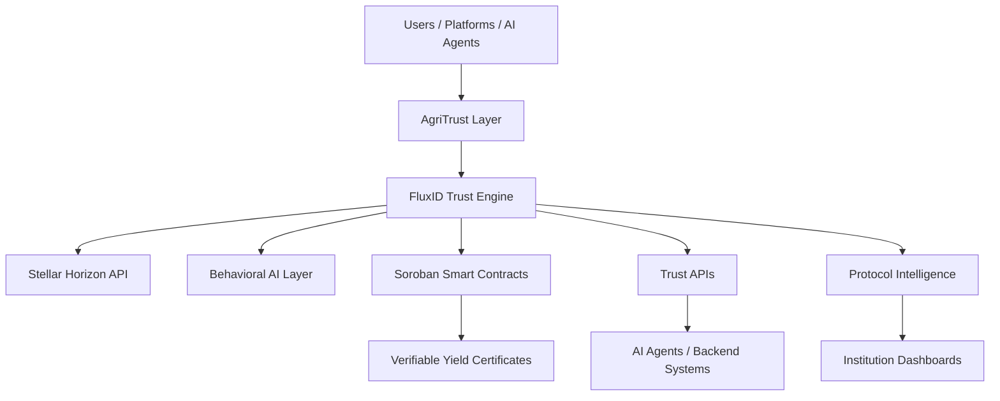

# FluxID

> Programmable trust infrastructure for wallets, platforms, AI systems, and underserved economies.

[](https://stellar.org)
[](https://soroban.stellar.org/)
[](https://anthropic.com/)

---

# Overview

FluxID is a programmable trust infrastructure built on Stellar that transforms wallet behavior into real-time financial trust signals.

Instead of measuring only balances or static assets, FluxID analyzes:

- inflow consistency
- outflow stability
- transaction rhythm
- liquidity behavior
- financial reliability over time

and converts them into:

- Trust Scores
- Risk Signals
- Behavioral Insights
- Programmable Financial Intelligence

FluxID enables platforms, protocols, institutions, and AI systems to make trust-aware financial decisions instantly.

---

# AgriTrust

AgriTrust is the first major vertical built on top of FluxID.

It focuses on solving one of the largest financial inclusion problems globally:

> Smallholder farmers without access to trusted financial identity, credit, insurance, or liquidity.

AgriTrust converts agricultural behavior into programmable financial trust.

Together:

- **FluxID** = programmable trust infrastructure
- **AgriTrust** = agricultural trust & liquidity layer
- **VYC** = Verifiable Yield Certificate primitive

---

# Core Idea

Traditional systems measure:

- what people own
- static collateral
- banking history

FluxID measures:

- behavioral consistency
- financial reliability
- transaction rhythm
- liquidity stability

This creates a new behavioral trust primitive for:

- lending
- payroll
- remittance
- marketplaces
- protocol monitoring
- AI agents
- agricultural finance
- machine-to-machine financial systems

---

# The Problem

## Financial Trust Is Broken

Globally, millions of people remain financially invisible.

Especially across:

- Africa
- Latin America
- Southeast Asia
- underserved rural economies

Most people lack:

- formal credit history
- collateral
- reliable banking access
- financial reputation systems

Even in Web3:

- wallets are anonymous
- reputation is fragmented
- platforms cannot measure real financial reliability

Trust becomes guesswork.

---

# The Agricultural Gap

Smallholder farmers represent one of the world's largest underserved financial groups.

Despite powering food supply chains:

- they cannot access affordable credit
- they lack trusted financial identity
- they operate in informal systems
- they are treated as high-risk by default

Traditional systems require:

- land titles
- formal banking records
- static collateral

Most farmers have none.

---

# The Solution

FluxID introduces:

> Behavioral Financial Identity

Instead of asking:

> “Who are you?”

FluxID asks:

> “How do you behave financially over time?”

The system analyzes wallet activity and generates:

- Trust Score (0–100)
- Risk Level
- Behavioral Insights
- Financial Stability Signals
- Protocol-Level Intelligence

AgriTrust extends this into agriculture by transforming farming behavior into programmable liquidity access.

---

# Architecture



---

# Product Layers

# 1. Wallet Intelligence Layer

Single-wallet behavioral analysis.

Users can:

- paste any Stellar wallet
- analyze financial behavior
- receive trust scores instantly
- understand risk patterns

---

## Wallet Intelligence Features

### Trust Score

Behavioral reliability score:

- 0 = high risk
- 100 = highly reliable

---

### Risk Categories

- Low Risk
- Medium Risk
- High Risk

---

### Behavioral Factors

FluxID analyzes:

- inflow consistency
- spending volatility
- transaction frequency
- counterparties
- liquidity rhythm
- behavioral drift

---

### AI Explainability

The AI layer explains:

- why a score exists
- what created risk
- what can improve reliability

Example:

```json
{
  "score": 82,
  "risk": "Low",
  "insight": "This wallet demonstrates stable inflow activity with low spending volatility.",
  "suggestions": [
    "Maintain transaction consistency",
    "Reduce irregular outflows"
  ]
}
```

---

# 2. Protocol Intelligence Layer

FluxID evolves beyond single wallets into:

> ecosystem-wide trust intelligence.

Platforms can analyze:

- entire user bases
- wallet cohorts
- lending pools
- ecosystem health
- behavioral trends

---

## Features

### User-Base Health Metrics

Monitor:

- average trust score
- risk distribution
- ecosystem deterioration
- behavioral trends

---

### Cohort Engine

Query wallets using:

- score thresholds
- inflow conditions
- activity frequency
- contract interactions
- behavioral trends

---

### Risk Heatmaps

Visualize:

- risky wallet clusters
- dangerous counterparties
- ecosystem stress zones
- concentrated instability

---

### Early Warning System

Detect:

- sudden risk spikes
- abnormal behavioral shifts
- protocol deterioration
- instability events

---

### Scalable Protocol Sync Engine

FluxID supports large-scale protocol analysis through asynchronous synchronization.

Flow:

1. Protocol enters contract ID
2. FluxID enumerates wallets interacting with contract
3. Wallets are scored asynchronously
4. Aggregations and analytics become queryable

This enables:

- full user-base intelligence
- cached trust infrastructure
- production-scale analytics

---

# 3. Agent Gateway

Machine-to-machine trust infrastructure.

AI agents and backend systems can:

- request trust signals
- automate evaluations
- pay per query
- integrate trust into workflows

Supports:

- MCP integrations
- X402 payment-gated APIs
- autonomous financial systems

---

## Example Agent Flow

1. Agent requests wallet score
2. FluxID returns payment requirement
3. Agent pays in XLM
4. Score + insights returned automatically

---

# AgriTrust

# Overview

AgriTrust is the first real-world vertical built on FluxID.

It transforms agricultural behavior into:

- financial identity
- programmable collateral
- liquidity access
- trust-backed financing

---

# Verifiable Yield Certificate (VYC)

The VYC is a behavioral trust primitive representing:

- expected harvest reliability
- farming consistency
- payment stability
- agricultural trustworthiness

Generated from:

- wallet activity
- supplier interactions
- stablecoin flows
- seasonal patterns
- farming behavior

---

# How AgriTrust Works

## Step 1 — Behavioral Activity

Farmers interact through:

- wallet payments
- supplier purchases
- cooperative interactions
- verified agricultural anchors

---

## Step 2 — Trust Analysis

FluxID evaluates:

- consistency
- stability
- transaction behavior
- historical reliability

---

## Step 3 — VYC Generation

The system creates:

- farmer trust score
- risk profile
- behavioral intelligence
- Verifiable Yield Certificate

---

## Step 4 — Liquidity Access

Financial providers can:

- issue loans
- provide insurance
- fund harvests
- underwrite risk

using behavioral trust instead of traditional collateral.

---

# Why Stellar

FluxID is built on Stellar because Stellar provides:

- fast settlement
- low transaction fees
- stablecoin infrastructure
- strong EMEA payment rails
- Soroban smart contracts
- scalable cross-border payments

This makes Stellar ideal for:

- emerging markets
- microtransactions
- financial inclusion
- programmable finance

---

# Tech Stack

| Layer           | Technology                           |
| --------------- | ------------------------------------ |
| Blockchain      | Stellar                              |
| Smart Contracts | Soroban + Rust                       |
| Frontend        | Next.js + TypeScript                 |
| Backend         | Node.js + Fastify                    |
| Wallet          | Freighter                            |
| AI Layer        | Behavioral Intelligence Engine       |
| Styling         | TailwindCSS                          |
| APIs            | REST + MCP-compatible infrastructure |

---

# Frontend Structure

## Wallet Intelligence

Single-wallet analysis.

Tabs:

- Dashboard
- Analytics
- Transactions
- Insights

---

## Protocol Intelligence

Institution and ecosystem analytics.

Tabs:

- Overview
- Risk Heatmaps
- Cohorts
- Alerts
- Agent Gateway

---

## AgriTrust

Agricultural intelligence layer.

Tabs:

- Farmer Profiles
- Yield Health
- Seasonal Analytics
- VYC Marketplace
- Insurance Status

---

# Smart Contract Philosophy

Smart contracts remain intentionally lightweight.

On-chain responsibilities:

- trust metadata
- score references
- timestamps
- VYC records

Avoid:

- heavy analytics on-chain
- unnecessary computation
- excessive protocol complexity

---

# API Structure

## Wallet APIs

```text
GET /score/:wallet
GET /insights/:wallet
GET /transactions/:wallet
```

---

## Protocol APIs

```text
GET /protocol/health
GET /protocol/cohorts
GET /protocol/risk
GET /protocol/alerts
```

---

## AgriTrust APIs

```text
GET /farmer/:wallet
GET /yield/:wallet
GET /vycl/:wallet
GET /agri/risk
```

---

# Current Status

# Phase 1 — MVP ✅

Completed:

- wallet scoring engine
- AI explainability
- wallet dashboard
- trust analysis
- address-based analysis
- Stellar integrations

---

# Phase 2 — Protocol Intelligence 🏗️

In Progress:

- protocol-wide analytics
- cohort engine
- risk heatmaps
- early warning systems
- scalable sync engine
- AI agent infrastructure
- programmable trust APIs

---

# Phase 3 — AgriTrust 🌾

Upcoming:

- farmer trust profiles
- Verifiable Yield Certificates
- agricultural financing layer
- stablecoin settlement
- liquidity infrastructure

---

# Phase 4 — Programmable Finance Layer ⚡

Future:

- programmable trust rules
- configurable risk engines
- natural language trust queries
- composable trust infrastructure

---

# Phase 5 — Internet of Value 🌍

Long-term vision:

- decentralized behavioral reputation
- cross-platform trust signals
- global financial identity
- autonomous financial coordination
- programmable trust economy

---

# Strategic Positioning

FluxID is NOT:

- another analytics dashboard
- another wallet explorer
- another lending app

FluxID IS:

> A programmable trust infrastructure for financial systems.

AgriTrust IS:

> The first behavioral liquidity layer for agriculture built on top of FluxID.

---

# Vision

> The programmable trust layer for the Internet of Value.

A future where:

- trust is behavioral
- reputation is programmable
- liquidity is intelligent
- AI systems can evaluate financial reliability autonomously

---

# Demo

- 🌐 Live App: https://fluxid.vercel.app/
- 📊 Pitch Deck: https://docs.google.com/presentation/d/1RkhWXOQRWWKaiUFeHB_PFUDzVjQmw2m8/edit
- ▶️ Demo Video: https://www.loom.com/share/ba5e12068bae47b1ac6d504b3f1039d2

---

# Contributors

Built by the FluxID team.

Core Contributors:

- @bbkenny
- @nonso7

---

# License

MIT License
